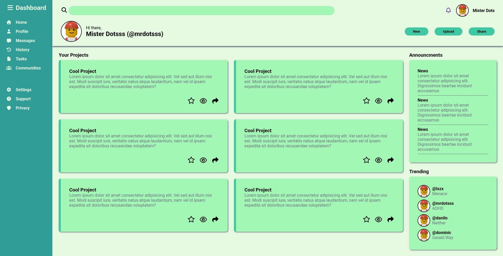
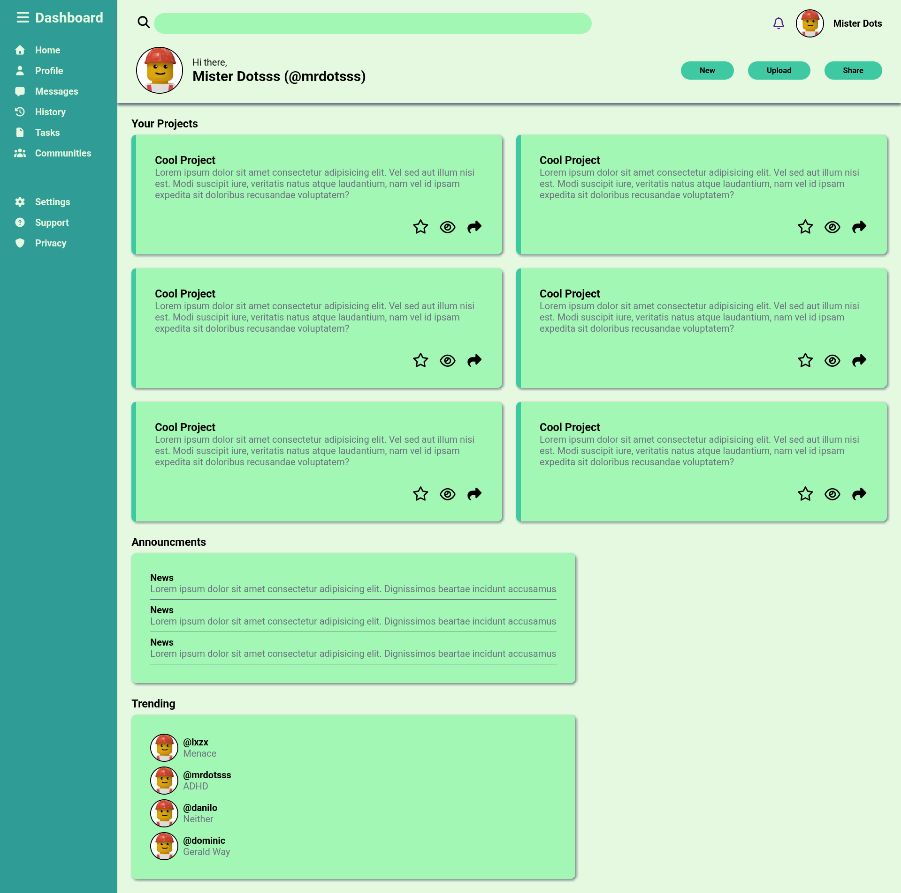
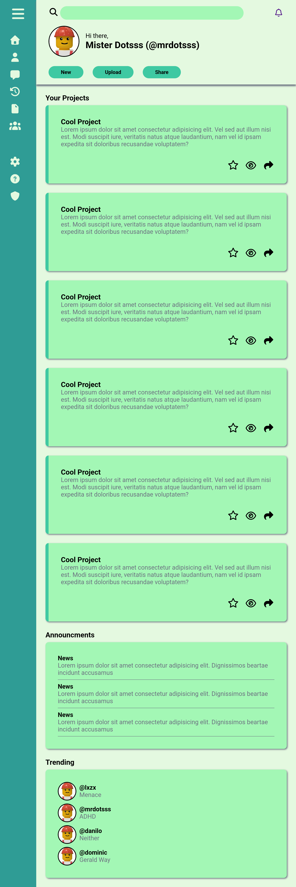

# 🖥️ Admin Dashboard Project

This project is part of the **Intermediate HTML and CSS** section of [The Odin Project](https://www.theodinproject.com). The goal is to build a fully responsive **Admin Dashboard layout** using **CSS Grid**, focusing on layout structure, design accuracy, and modern CSS practices.

---

## 📌 Objectives

- Apply **CSS Grid** for a multi-section layout.
- Practice **component structuring** with semantic HTML.
- Reinforce **responsive design** principles.
- Develop a clean and visually organized **dashboard interface**.
- Enhance understanding of spacing, alignment, and UI layout fundamentals.

---

## 🧩 Project Requirements

- A top navigation bar (header)
- A sidebar for navigation links
- A main content area with multiple card sections:
  - Project cards
  - Announcements section
  - Trending section
- Use **icons, avatars, and dummy content** to make it visually complete
- Ensure the layout is **responsive** (adjusts for smaller screens)
- All layout must be done in **raw CSS** (no frameworks)

---

## 🛠️ Tools Used

- HTML5
- CSS3 (Grid, Flexbox, etc.)
- [Font Awesome](https://fontawesome.com/) or any icon library *(optional)*
- [Google Fonts](https://fonts.google.com/) *(optional)*

---

## 📸 Preview

---

## 📚 What I Learned

- Structuring complex layouts with CSS Grid
- Organizing CSS code for maintainability
- Building a scalable UI from scratch
- Understanding component positioning without JS

---

> 💡 *This is a front-end design project — no JavaScript logic is required yet.*

